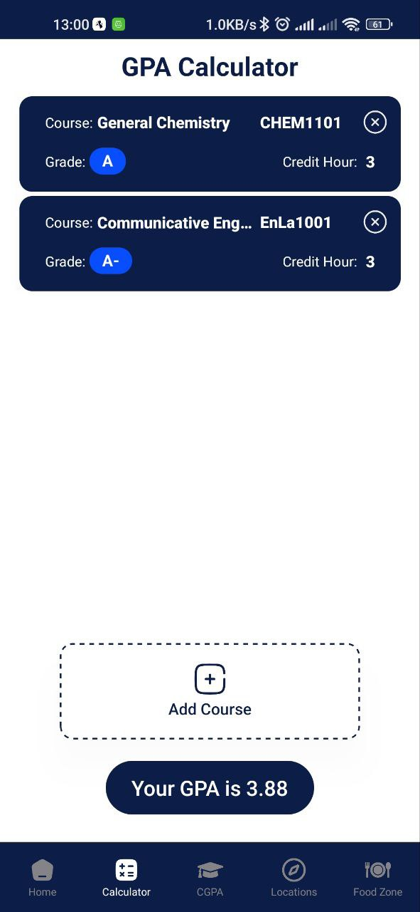
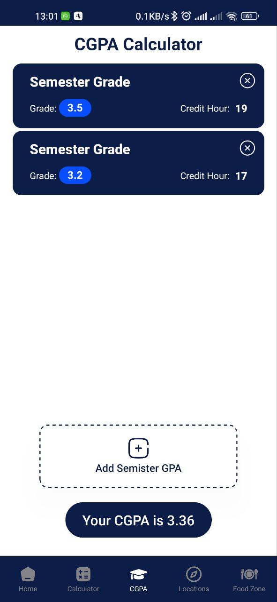
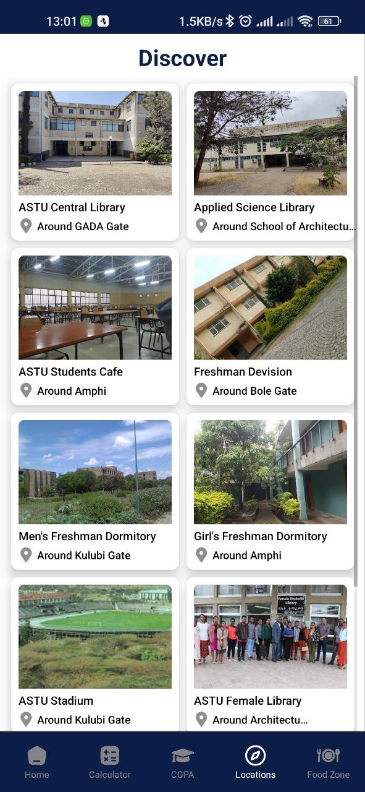
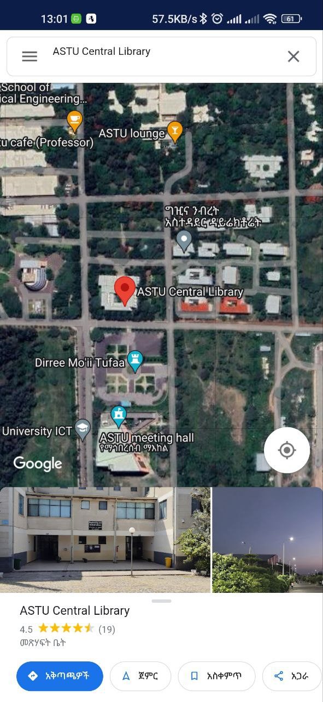

# Welcome to your ASTU app 👋

## Features

1. **📈 GPA Calculator**: Calculate your current semester GPA easily.
2. **📊 CGPA Calculator**: Calculate your cumulative GPA over multiple semesters.
3. **🌍 Explore Locations**: Discover interesting locations around you.
4. **🍴 Food Zone Locator**: Find nearby food zones and restaurants.

## Screenshots

### 📈 GPA Calculator Screen
<div style="display:flex; flex-direction:row;">
  
</div>

### 📊 CGPA Calculator Screen
<div style="display:flex; flex-direction:row;">
  
</div>

### 🌍 Explore Locations Screen
<div style="display:flex; flex-direction:row;">
  
  
</div>

### 🍴 Food Zone Locator Screen
<div style="display:flex; flex-direction:row;">
  
</div>


## 🛠️ Installation

1. **Clone the repository**
   ```bash
   git clone https://github.com/ski-p3r/astu-app.git
   cd astu-app
   ```

2. Start the app

   ```bash
    npx expo start
   ```

In the output, you'll find options to open the app in a

- [development build](https://docs.expo.dev/develop/development-builds/introduction/)
- [Android emulator](https://docs.expo.dev/workflow/android-studio-emulator/)
- [iOS simulator](https://docs.expo.dev/workflow/ios-simulator/)
- [Expo Go](https://expo.dev/go), a limited sandbox for trying out app development with Expo

You can start developing by editing the files inside the **app** directory. This project uses [file-based routing](https://docs.expo.dev/router/introduction).

## 🚀 Usage

   ### 📈 GPA Calculator
   1. Navigate to the GPA Calculator screen.
   2. Enter your course grades and credit hours.
   3. Press 'Calculate' to get your GPA.

   ### 📊 CGPA Calculator
   1. Navigate to the CGPA Calculator screen.
   2. Enter your GPA for each semester along with total credit hours.
   3. Press 'Calculate' to get your CGPA.

   ### 🌍 Explore Locations
   1. Navigate to the Explore Locations screen.
   2. Allow location permissions if prompted.
   3. Browse through the list of nearby locations.

   ### 🍴 Food Zone Locator
   1. Navigate to the Food Zone Locator screen.
   2. Allow location permissions if prompted.
   3. Browse through the list of nearby food zones and restaurants.

## 🤝 Contributing

We welcome contributions! Please read our [Contributing Guidelines](CONTRIBUTING.md) for details on how to get started.


## 📜 License

This project is licensed under the MIT License - see the [LICENSE](LICENSE) file for details.

## 🙏 Acknowledgements

- This app was developed using [React Native](https://reactnative.dev/) and [Expo](https://expo.dev/).
- Thanks to all the open-source libraries and contributors.


<!-- ## 📧 Contact

If you have any questions or feedback, feel free to reach out to us at support@gpacalculatorapp.com. -->
